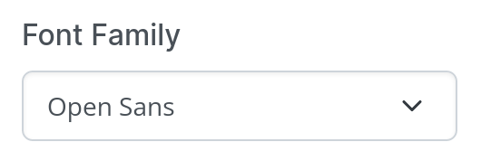
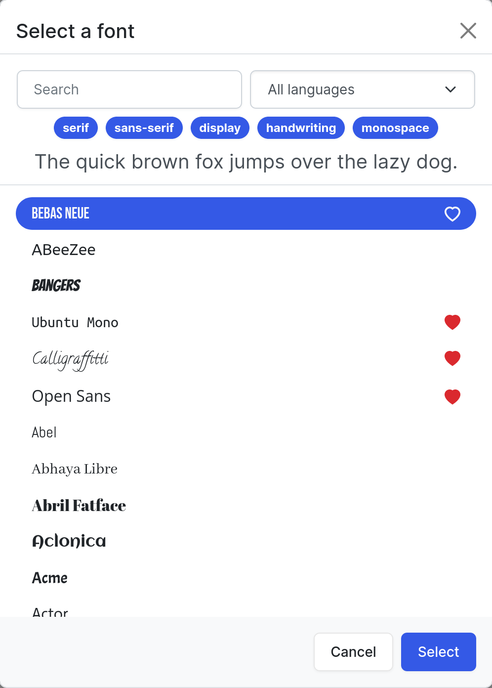

# Bootstrap 5 Google Fonts Picker
A Google fonts picker input element, powered by Bootstrap. The picker uses 99.9% Bootstrap, and thus, should work with almost all Bootstrap themes.

## Features
 - dynamically loads fonts
 - stores favourites and recents
 - support for custom (local) fonts
 - search, category and language filters
 - translations for `en, nl, de, es, fr`
 - no JQuery, pure ES6

## Screenshots



## Usage
### Initialization
First, the font picker **must** be initialized.
```js
import FontPicker from "./fontpicker.min.js";

FontPicker.initialize({
    localFonts: false,
    language: "en",
});
```

### Creation
Then, font picker inputs can be created. This can be done by attaching to an existing input element, or creating a new one:
```js
// atach to an existing one
const input = document.getElementById("font");
const picker1 = FontPicker.attach(input);
// create a new one
const picker2 = FontPicker.create();
```

### Methods
These inputs can be opened and set programatically:
```js
picker.open();
picker.setFont("Open Sans"); // set font family only
picker.setFont("Open Sans:800i"); // set font family, weight and style
picker.setFont({ // set from object
    family: "Open Sans",
    weight: "800",
    style: "italic",
});
```

The current font can also be retrieved as an object:
```js
picker.getFont() -> {
    family: "Example Font",
    weight: "800",
    style: "regular",
}
```

### Events
A font picker input can also be listened to for the **input** event:
```js
fontPicker.addEventListener("input", (e) => {
    console.log(e.target.value);
    console.log(e.target.getFont());
});
```

### Font Loading
If you want to ensure a font is loaded (e.g. for canvas text):
```js
import FontPicker from "./fontpicker.min.js";

await FontPicker.loadFont("Open Sans");
console.log("Font loaded!");
```

## Examples
Examples can be found in the `example/` folder.

## Documentation
All documentation can be found in the `docs/` folder.

## Dependencies
The picker requires both a Bootstrap 5 CSS and JS file in order to work properly.
